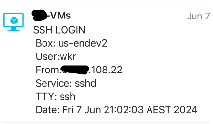

# LOGIN NOTIFICATIONS<br>
Receive push message notification whenever there is a connection to Ubuntu.  This is achieved via a script plus simple edits of PAM triggers to call the script which send the push messages via an account with push message client pushover.<br><br>
The messages give basic details about:<br>
* which message group
* connection type (ssh/terminal/desktop gui)
* connected box name
* connected box user authenticed as
* PAM details
* timestamp<br><br>
 <br><br><br>
## SETUP PUSH MESSAGE ACCOUNT + APP
### 1:  Create [http://pushover.net](http://pushover.net) account<br>
* Create account + install app on message device<br>
* Use free trial to test / $5 once per device class perpetual licence<br>
* This will give you a `user api key` to put in script below<br>
* Not affiliated, found randomly on web and works well<br><br>
### 2:  Create pushover.net application<br>
* Create application under your user account eg WorldMobile, Iagon, Encoins, logons etc (however you want to group messages by in app)
* This will give a second `application api-key` to be used in conjunction with above `user api key` in script below - so 2 keys total<br>
* Optional: add thumbnail image to application so messages with embeded logo look different - [sample thumbnails](assets/) eg:<br><br>
 <br><br>
## NOTIFICATION SCRIPT + LOGON TRIGGERS
### 1: Install curl (if not already)
```bash
sudo apt-get update && sudo apt-get upgrade && sudo apt install curl
```
### 2:  Create notification script<br>
* This script will be called by logon detection triggers originating from Ubuntu PAM (pluggable access modules)<br>
* For this example, script is stored in `/opt/my_scripts` and called `login_notification.sh` but you can change + filter through below<br>
* run the following to create empty script file script + restrict permissions so sudo required to stop it

    ```bash
    sudo mkdir -p /opt/my_scripts && \
    sudo touch /opt/my_scripts/login_notification.sh && \
    sudo chmod 700 /opt/my_scripts/login_notification.sh && \
    sudo chown root:root /opt/my_scripts/login_notification.sh
    ```

* run the following to put the code into the script 

   ```bash
   sudo tee /opt/my_scripts/login_notification.sh > /dev/null <<EOF
   #!/bin/bash
   # NOTIFICATION SCRIPT FOR TRIGGERING PUSH MESSAGE ON LOGIN EVENTS
   # Make sure to place userkey + apikey in the strings below
   # We want to trigger the script only when the SSH session starts.
   # To be notified also when session closes, you can watch for the "close_session" value.
   # NB have set to always succeed via true but have gaps in experience here with this vs PAM required or optional
   #  Will be loading as PAM optional as I dont think logic and output will fail
   if [[ "$PAM_TYPE" == "open_session" ]]; then
   		  # Is this console or ssh?  Is triggered from both
   		  if   [ "$PAM_SERVICE" == "sshd" ];         then LoginType="SSH"
   		  elif [ "$PAM_SERVICE" == "login" ];        then LoginType="CONSOLE"
   		  elif [ "$PAM_SERVICE" == "gdm-password" ]; then LoginType="GUI"
   		  else LoginType="MYSTERY"
   		  fi
   		  #Construct message
   		  PO_MSG="$LoginType LOGIN\n Box: `uname -n`\n User:$PAM_USER\n From:$PAM_RHOST\n Service: $PAM_SERVICE\n TTY: $PAM_TTY\n Date: `date`"
   
   		  #Send notification
   		  curl -s --connect-timeout 5 \
   				--form-string "token=appkeyappkeyappkeyappkeyappkey" \
   				--form-string "user=userkeyuserkeyuserkeyuserkeyyy" \
   				--form-string "message=`echo -e $PO_MSG`" \
   				https://api.pushover.net/1/messages.json > /dev/null 2>&1 || true
   fi
   exit 0
   EOF
   ```

* edit script to replace your 2 pushover keys (user api key + application api key) into the curl command leaving double quotes as they are

        sudo nano /opt/my_scripts/login_notification.sh
### 3:  SSH trigger<br>
* Edit sshd PAM:

   ```bash
   sudo nano /etc/pam.d/sshd
   ```

* add line at end:

   ```bash
   session    optional     pam_exec.so /opt/my_scripts/login_notification.sh
   ```

### 4:  Console/Terminal trigger<br>
* Edit login PAM:

   ```bash
   sudo nano /etc/pam.d/login
   ```

* and line near end above final 3x @include calls:

   ```bash
   session    optional   pam_exec.so    /opt/my_scripts/login_notification.sh
   ```

### 5:  GUI Login trigger (desktop Ubuntu)<br>
* N/A for cli only servers, this trigger is only for Ubuntu desktop GUI panels
* Edit relevant PAM:

   ```bash
   sudo vi /etc/pam.d/gdm-password
   ```
* add line near end (just above final @include common-session):

   ```bash
   session optional        pam_exec.so /opt/my_scripts/login_notification.sh
   ```
